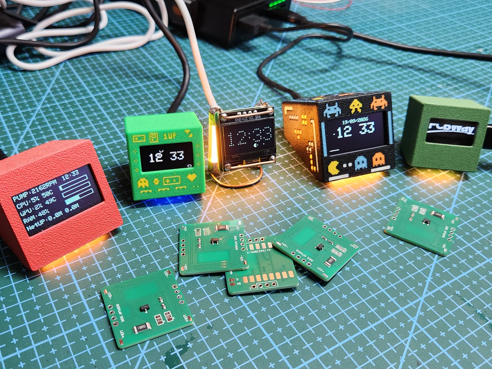
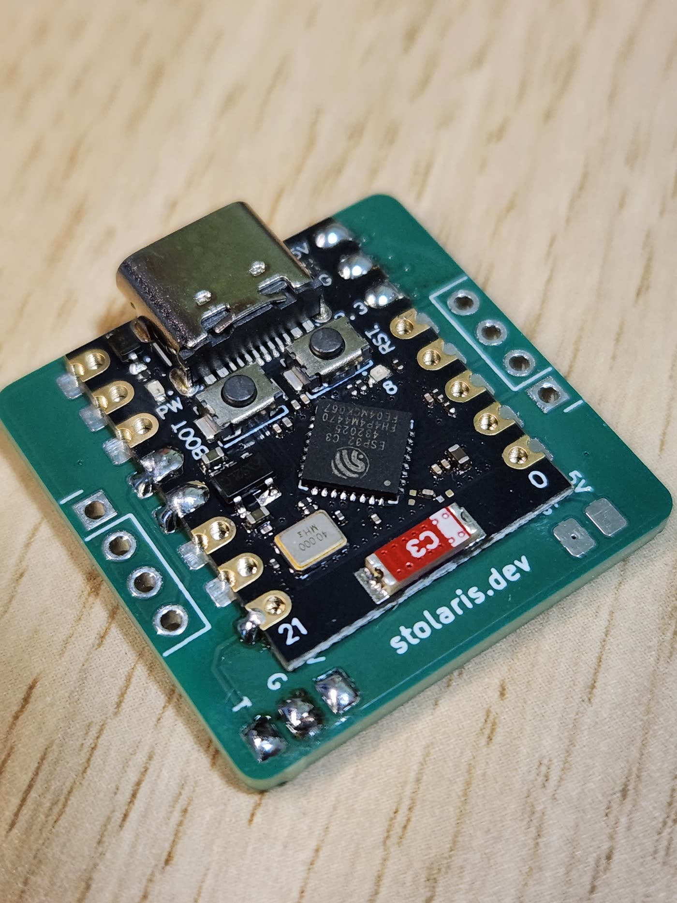
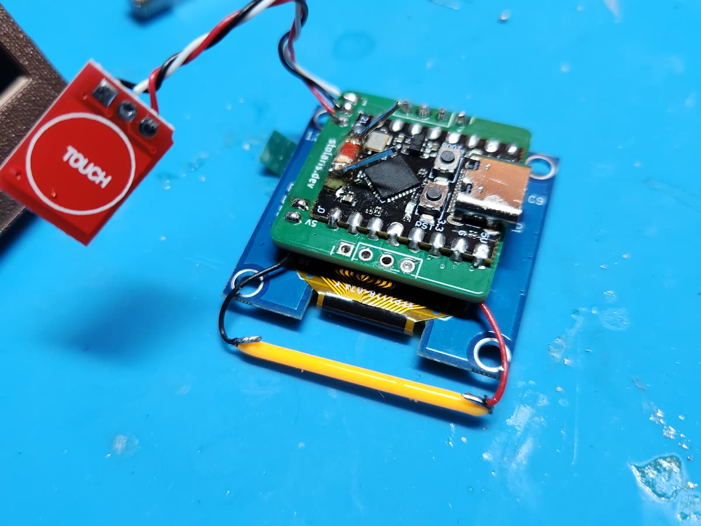
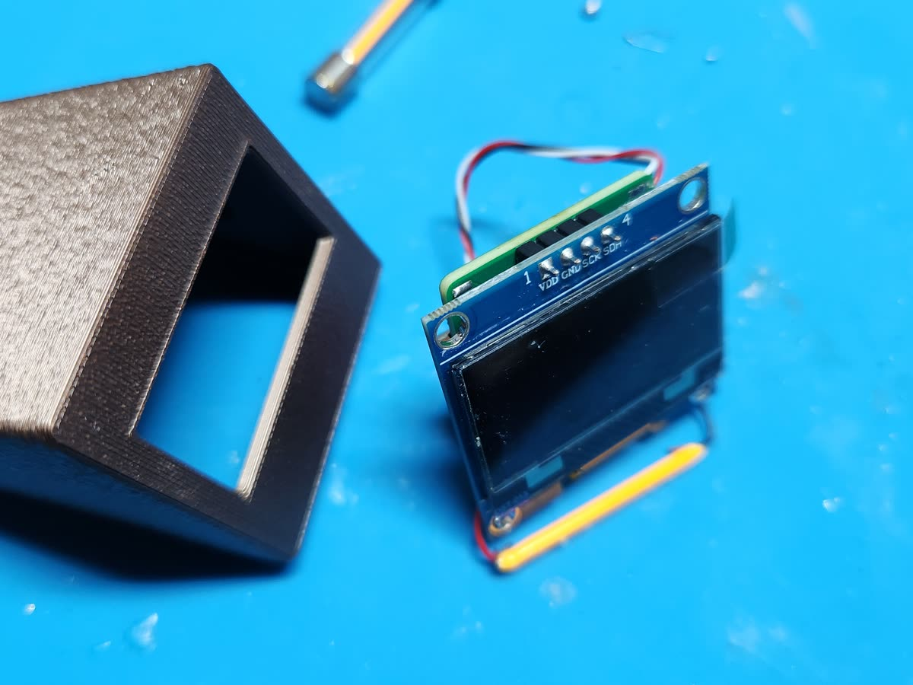
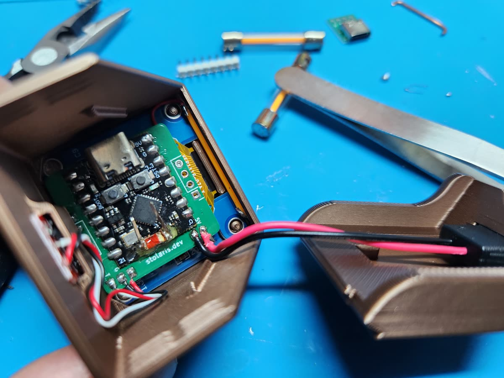
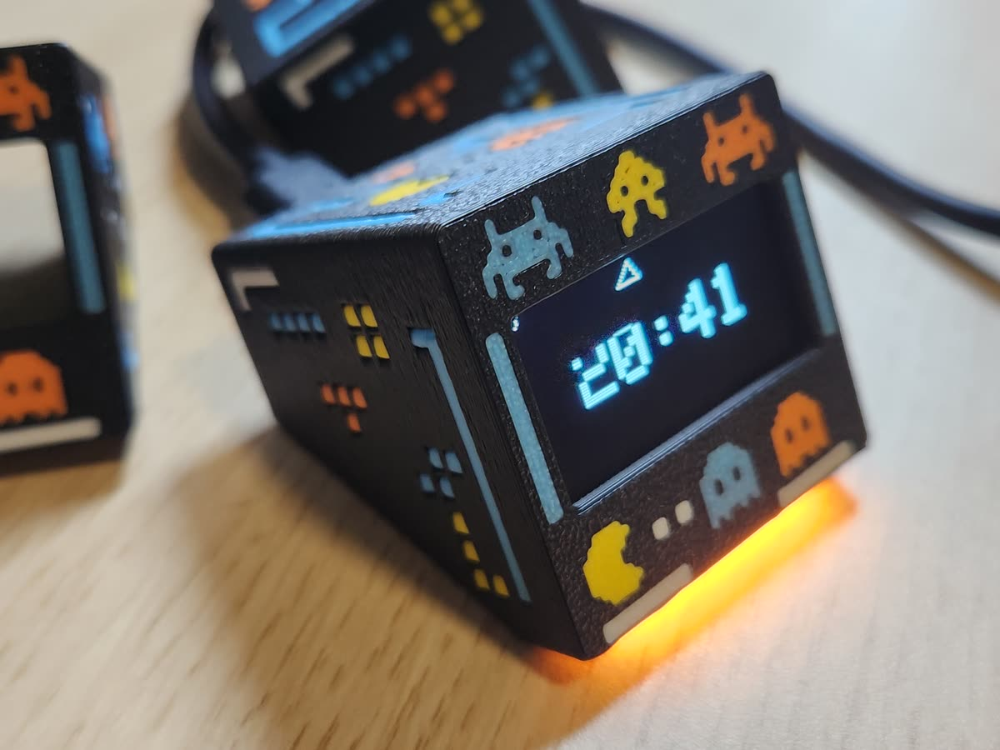

# SmallOLED Carrier PCB

A purpose-built carrier board for SmallOLED. It replaces the hand-wired build with a single 27 x 27 mm PCB that holds the ESP32-C3 SuperMini, the OLED header and the optional filament LED driver, so the whole device fits cleanly inside the 3D printed enclosure.

**The PCBs for this board were provided by [PCBWay](https://www.pcbway.com/), who sponsored the assembly video below.**

## Board at a glance

| | |
|---|---|
| Size | 27 x 27 mm |
| Layers | 2 |
| Thickness | 1.6 mm |
| Controller | ESP32-C3 SuperMini, soldered flat onto 16 elongated SMD lands |
| Display | 4-pin I2C header: GND, VCC, SCL, SDA |
| Displays that fit | 0.96" SSD1306 and 1.3" SH1106 |

The SuperMini has no pin headers on this board. It is soldered straight onto the carrier lands, which is what keeps the stack low enough for the small enclosure.

Four parts are surface mount on the bottom side. PCBWay assembled these at the factory, so the boards arrived ready to build on:

| Ref | Part |
|---|---|
| Q1 | AO3400A |
| R1 | 18R 2010 |
| R2 | 100R 0603 |
| R3 | 10k 0603 |

Everything else is hand soldered. The full build is shown in the video.

## Building a 1.3 inch unit

The same 27 x 27 mm carrier drives the 1.3" SH1106 through the 4-pin I2C header. These shots are from a 1.3" build with the optional TTP223 touch button and a filament LED, going into the dedicated 3D printed case.

<table>
  <tr>
    <td width="50%"></td>
    <td width="50%"></td>
  </tr>
  <tr>
    <td>Display, touch button and filament LED soldered to the carrier.</td>
    <td>The printed frame and the display, ready to go together.</td>
  </tr>
  <tr>
    <td width="50%"></td>
    <td width="50%"></td>
  </tr>
  <tr>
    <td>Everything folds into the case.</td>
    <td>Finished unit, filament LED lit.</td>
  </tr>
</table>

## 3D printed cases

These cases live in this repository rather than on MakerWorld, because they only fit the carrier PCB. Both are Bambu Studio projects, and each project has two plates holding everything needed for one device.

| Display | Download | Plate 1 | Plate 2 |
|---|---|---|---|
| 0.96" SSD1306 | [3MF](case/SmallOLED-Case-0.96-PCB.3mf) | `no front graphics`, plain face | `front graphics`, retro motifs on the face |
| 1.3" SH1106 | [3MF](case/SmallOLED-Case-1.3-Retro-PCB.3mf) | `FuzzySkin on black`, textured shell | `No fuzzy skin`, smooth shell |

On the 0.96" case, the front graphics plate is painted across several filaments, so print that one with an AMS or accept a single colour.

**The 1.3" case has no USB-C opening in the side wall.** It is built around a panel-mount USB-C socket on a flying lead, [like this one](https://aliexpress.com/item/1005007148475800.html), soldered to the 5V and GND pads on the carrier instead of using the SuperMini's own connector. Get one before you print this case.

Cases for the 1.54" and 2.42" displays are the standard hand-wired builds and stay on MakerWorld, linked at the top of the [README](README.md).

## Assembly video

[Build a SmallOLED PC Monitor: ESP32-C3, custom PCB and 3D printed case](https://youtu.be/5O7uISlaXd4)

The video covers flashing the firmware from a browser, unboxing the boards, soldering the controller and the OLED, the optional antenna modification, and fitting everything into the enclosure.

## Ordering the board

The board is published as a PCBWay Shared Project, with gerbers, BOM and pick and place files attached:

**[Order the SmallOLED Carrier from PCBWay](https://www.pcbway.com/project/shareproject/SmallOLED_Carrier_27x27_mm_ESP32_C3_SuperMini_board_for_an_I2C_OLED_PC_stats_m_c42149ed.html)**

Ordering through the shared project page also returns 10% to the project.

## Sponsorship

PCBWay manufactured the boards used in the assembly video and in the photos above, including the SMT assembly of the transistor and the three resistors, and supplied them at no cost. The board design, the firmware and everything else in this repository are my own work, and nothing about the project changed in exchange for the boards.
